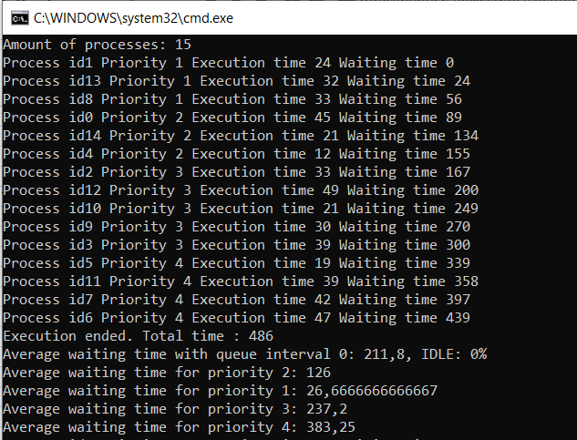
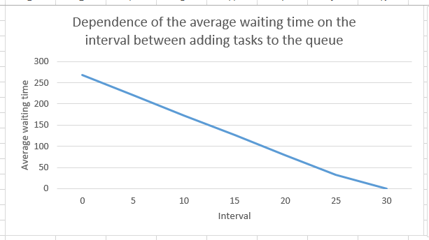
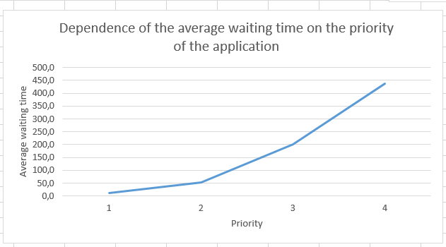
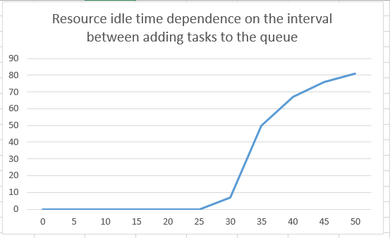

# FIFO algorithm with priorities
## Process description
- `Id` - process Id
- `ExecutionTime` - time needed to execute the process
- `WaitingTime` - time needed to begin the process execution
- `Priority` - priority among other processes
## Algorithm description
- Each `Process` has it's own `Priority`
- 'Process' asks for a resource
- Depending on `Priority`, `Process` enters the queue on the last place of it's `Priority` group
- First entered `Process` with the highest `Priority` is being executed
- Executed `Process` leaves the queue
- Repeat 2 previous steps until the queue is empty
## Advanteges
- Easy to implement and understand
- High priority tasks can be executed very fast
## Disadvanteges
- 'Convoy' effect
- Very high average awaiting time
- Wrong priority system may cause low priority processes to wait too long
## Example
### Manage 15 processes and calculate average awaiting time, IDLE and average awaiting time for each priority

## Graphs
### Dependence of the average waiting time on the interval between adding tasks to the queue

### Dependence of the average waiting time on the priority of the application

### Resource idle time dependence on the interval between adding tasks to the queue

